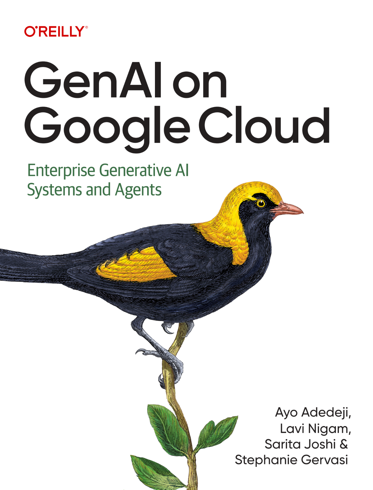
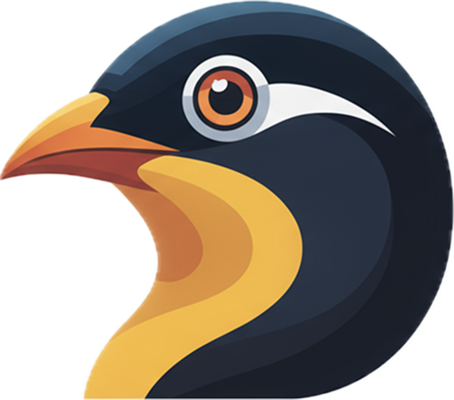

<div align="center">
  
  
  # GenAI on Google Cloud: Exercises & Projects
  
  ### Building Production-Ready LLM Applications with Vertex AI
  
  **Authors:** [Ayo Adedeji](https://linkedin.com/in/ayoadedeji), [Lavi Nigam](https://linkedin.com/in/lavinigam), [Sarita A Joshi](https://linkedin.com/in/sarjoshi9), [Stephanie Gervasi](https://linkedin.com/in/stephaniegervasi)
  
  [](https://colab.research.google.com/)
  [](https://opensource.org/licenses/MIT)
  [](https://www.python.org/downloads/)
</div>

---

## 📚 About This Repository

This repository contains hands-on exercises, code samples, and projects accompanying the book **"GenAI on Google Cloud: Enterprise Generative AI Systems and Agents"**. Each chapter folder includes:

- **Colab Notebooks** - Interactive tutorials and exercises
- **Projects** - End-to-end implementations
- **Solutions** - Reference implementations (selected exercises)

## 🚀 Getting Started

### Prerequisites
- Google Cloud Platform account
- Vertex AI API enabled
- Python 3.9 or higher

### Setup Instructions
```bash
# Clone this repository
git clone https://github.com/ayoisio/genai-on-google-cloud.git

# Install required dependencies
pip install -r requirements.txt

# Configure Google Cloud credentials
gcloud auth application-default login
```

## 📖 Chapter Overview


### [Chapter 1: The Challenge of LLM Application Development](./chapter-1/)
Introduction to LLM complexities and production deployment challenges.

- **Topics:** LLM fundamentals, SLM vs LLM tradeoffs, agent architecture (model, tools, orchestration, runtime), context engineering strategies (prompting, RAG, controlled generation)
- **Resources:** 3 Coursera courses, 6 video tutorials, links to 5 official Gemini 3 getting-started notebooks

---

### [Chapter 2: Data Readiness and Accessibility](./chapter-2/)
Comprehensive strategies for preparing data for LLM applications.

- **Topics:** Data readiness dimensions, unified data platform, document processing, RAG evolution (Naive → Advanced → Agentic), vector search, GraphRAG with Spanner, enterprise RAG patterns, security & governance
- **Hands-On:** 8 Colab notebooks across two learning paths
  - **Foundations (5):** BigQuery exploration, Document AI, embeddings, RAG pipeline, Vertex AI RAG Engine
  - **Advanced RAG (3):** Enterprise RAG with BigQuery/Cloud SQL, GraphRAG with Spanner Graph, Agentic RAG with MCP + ADK

---

### [Chapter 3: Building a Multimodal Agent with ADK](./chapter-3/)
Hands-on development of agents processing text, images, and video using Google's Agent Development Kit.

- **Topics:** Agent fundamentals, custom tools, multi-agent delegation, state management (session/user/app scopes), semantic memory with Vertex AI Memory Bank, multimodal processing, real-time streaming, security & guardrails
- **Hands-On:** 8 progressive samples following a SmartHome Customer Support theme
  - `01_hello_agent` — Basic agent in 7 lines
  - `02_tool_agent` — Custom function tools
  - `03_multi_agent` — Hybrid delegation architecture
  - `04_stateful_agent` — State management across scopes
  - `05_memory_agent` — Vertex AI Memory Bank integration
  - `06_multimodal_agent` — Image analysis and artifact generation
  - `07_streaming_agent` — Live API for voice-enabled agents
  - `08_guardrails_agent` — Callbacks, plugins, and enterprise compliance

---

### [Chapter 4: Orchestrating Intelligent Agent Teams](./chapter-4/)
Multi-agent systems, MCP, and A2A protocols for enterprise collaboration.

- **Topics:** Why monolithic agents don't scale, workflow agents (SequentialAgent, ParallelAgent, LoopAgent), state passing with output_key, Model Context Protocol (MCP) for tool access, Agent-to-Agent (A2A) protocol for delegation
- **Hands-On:** 8 samples with progressive complexity
  - `01_sequential_agent` through `03_loop_agent` — Workflow patterns
  - `04_mcp_agent` — MCP server integration
  - `05_a2a_server` / `06_a2a_client` — Distributed agent communication
  - `07_hybrid_agent` — Combined MCP + A2A architecture
  - `08_production_agent` — Production-ready patterns

---

### [Chapter 5: Evaluation and Optimization Strategies](./chapter-5/)
Metrics, benchmarking, and optimization techniques for LLM applications and agents.

- **Topics:** Evaluation dimensions (quality, task success, performance, robustness, safety), human-centered methods (rubrics, A/B testing, red teaming), automated metrics (ROUGE, BLEU, BERTScore), agent-specific metrics (tool usage, trajectory), LLM-as-Judge patterns, optimization strategies
- **Hands-On:** 2 code samples (`agent_eval`, `custom_eval`) + links to 27+ Vertex AI evaluation notebooks covering multimodal evaluation, custom metrics, and model comparison

---

### [Chapter 6: Tuning and Infrastructure](./chapter-6/)
Fine-tuning strategies and production inference infrastructure on Google Cloud.

- **Topics:** Fine-tuning decision framework, QLoRA (4-bit quantization + LoRA), infrastructure bottleneck patterns (bandwidth, memory, compute, network), deployment platforms (Agent Engine, Cloud Run, GKE, Vertex AI Prediction)
- **Hands-On:** 3 Colab notebooks + links to official Model Garden notebooks
  - `01_gemma_finetuning` — Fine-tune Gemma 7B with QLoRA for financial analysis
  - `02_model_garden_deployment` — Deploy models from Vertex AI Model Garden
  - `03_vllm_serving` — Efficient LLM serving with vLLM and PagedAttention

---

### [Chapter 7: MLOps for Production-Ready Models](./chapter-7/)
AgentOps practices for production AI systems — bridging "the model works" to "the model works in production."

- **Topics:** The 9 pillars of AgentOps, MLOps → GenAI Ops → Agent Ops evolution, data versioning & lineage, experiment tracking, model registry & governance, Vertex AI Pipelines, comprehensive monitoring with Cloud Trace, CI/CD with Cloud Build & Deploy, security with Model Armor, cost management with FinOps Hub
- **Hands-On:** 35+ curated Vertex AI notebooks across 10 categories
  - ML Metadata & lineage tracking
  - Experiment tracking with autologging
  - Model Registry and versioning
  - Pipelines (KFP, challenger vs blessed deployment)
  - Model Monitoring (drift detection, batch prediction)
  - Feature Store for LLM grounding
  - Deployment (dedicated endpoints, streaming, custom containers)
  - Explainable AI (feature attributions)
  - GenAI/LLM operations (resilience patterns)

---

### [Chapter 8: AI Maturity Framework](./chapter-8/)
Measuring and evolving your organization's AI capabilities with actionable frameworks.

- **Topics:** 3 maturity dimensions (Vision & Leadership, Talent & Culture, Operational & Technical), 3 phases (Tactical → Strategic → Transformational), governance and compliance (EU AI Act), Vertex AI Platform for MLOps, Gemini Enterprise for democratized AI
- **Resources:**
  - `maturity_assessment.md` — Self-assessment workbook (28+ questions)
  - `maturity_rubric.md` — Detailed phase descriptions and scoring
  - `use_case_mapping.md` — Value vs Effort prioritization template
  - `roadmap_template.md` — Phase transition planning guide
  - `resources.md` — Certifications, frameworks, and learning paths
- **Case Studies:** 3 fictional companies (Cymbal Health, Cymbal Retail, Cymbal Media) demonstrating phase transitions

## 🛠️ Technologies Used

- **Google Cloud Platform**: Vertex AI, BigQuery, Cloud Run, GKE
- **Frameworks**: Agent Development Kit (ADK)
- **Languages**: Python, SQL
- **Models**: Gemini, open-source models

## 📝 Contributing

We welcome contributions! Please see [CONTRIBUTING.md](./CONTRIBUTING.md) for guidelines.

## 📄 License

This project is licensed under the MIT License - see the [LICENSE](./LICENSE) file for details.

## 🔗 Additional Resources

- [Official Book Website](https://www.oreilly.com/library/view/genai-on-google-cloud)
- [Google Cloud Documentation](https://cloud.google.com/vertex-ai/docs)
- [Agent Development Kit (ADK)](https://github.com/google/adk)

## 💬 Support

For questions and discussions:
- Open an issue in this repository

---

<div align="center">
  
  
  
  **Happy Learning!**
</div>
