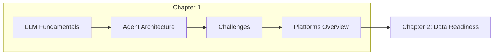

<div align="center">
  

  # Chapter 1: The Challenge of LLM Application Development
</div>

---

## Chapter Overview

This introductory chapter sets the foundation for understanding the unique complexities of building and deploying applications powered by Large Language Models (LLMs). It prepares you for subsequent discussions of LLMOps and the behind-the-scenes work required to manage the entire lifecycle of LLMs in production.

## Learning Objectives

Upon completing this chapter, you will be able to:

- **Define LLMs and foundation models** - Understand the "Large, Language, Model" characteristics and how multimodal foundation models differ from text-only LLMs
- **Compare SLMs vs LLMs** - Evaluate when to use small language models versus large language models based on task requirements, latency, and cost
- **Understand GenAI agents** - Identify the four key components of agents: Model, Tools, Orchestration, and Runtime
- **Apply context engineering techniques** - Implement prompt engineering, system instructions, RAG, and controlled generation
- **Navigate development challenges** - Address data quality, hallucinations, evaluation, and explainability challenges
- **Plan for deployment and maintenance** - Anticipate infrastructure, security, drift, and monitoring requirements

## Key Concepts

### What is an LLM?

| Component | Description |
|-----------|-------------|
| **Large** | Trained on enormous datasets containing billions or trillions of tokens |
| **Language** | Primary focus on understanding and generating human language |
| **Model** | Neural network using transformer architecture with attention mechanisms |

### SLM vs LLM Comparison

| Feature | Small Language Model (SLM) | Large Language Model (LLM) |
|---------|---------------------------|---------------------------|
| Parameters | Millions to hundreds of millions | Billions to trillions |
| Latency | Very low, near-instantaneous | Higher, but streamable |
| Use Case | Narrow, well-defined tasks | Versatile, general-purpose |
| Resources | Mobile/edge deployable | Requires GPU/TPU infrastructure |

### Agent Components

```
┌─────────────────────────────────────────────────────────┐
│                     AGENT RUNTIME                       │
│  ┌─────────────────────────────────────────────────┐   │
│  │              ORCHESTRATION                       │   │
│  │  ┌─────────┐    ┌────────┐    ┌─────────────┐  │   │
│  │  │  MODEL  │◄──►│ MEMORY │◄──►│   TOOLS     │  │   │
│  │  │  (LLM)  │    │ STATE  │    │   (APIs)    │  │   │
│  │  └─────────┘    └────────┘    └─────────────┘  │   │
│  └─────────────────────────────────────────────────┘   │
└─────────────────────────────────────────────────────────┘
```

### Context Engineering Strategies

| Strategy | Description |
|----------|-------------|
| **Prompt Engineering** | Crafting effective inputs (zero-shot, few-shot, chain-of-thought) |
| **System Instructions** | Persistent rules defining model identity and behavior |
| **RAG** | Grounding responses in external, verified data sources |
| **Controlled Generation** | Enforcing output structure and format (e.g., JSON schemas) |

## Chapter Challenges Overview

The chapter addresses three categories of challenges:

### Development Challenges
- Data quality, scale, and privacy
- Model selection and prompt engineering
- Hallucinations and explainability
- Evaluation beyond simple metrics

### Deployment Challenges
- Infrastructure and resource optimization
- Integration with enterprise systems
- Security (prompt injection, adversarial attacks)
- Cost management

### Maintenance Challenges
- Model and data drift
- Continuous monitoring
- Version control for models, prompts, and data

## Learning Resources

This chapter is conceptual and designed to prepare you for hands-on work in subsequent chapters. Explore these curated resources to deepen your understanding.

### Recommended Courses

| Course | Platform | Description |
|--------|----------|-------------|
| [Introduction to Generative AI](https://www.coursera.org/learn/introduction-to-generative-ai) | Coursera | Free introductory course on GenAI fundamentals, model types, and applications |
| [Google AI Essentials](https://www.coursera.org/specializations/ai-essentials-google) | Coursera | Productivity-focused specialization for daily work tasks |
| [Google Prompting Essentials](https://www.coursera.org/specializations/prompting-essentials-google/) | Coursera | Hands-on "5 steps of effective prompting" for text, data, and multimodal tasks |

### Video Tutorials

| Video | Topic |
|-------|-------|
| [Introduction to Artificial Intelligence](https://www.youtube.com/watch?v=bknUn7yMwNI) | How AI, ML, and GenAI differ and automate cognitive tasks |
| [Introduction to Responsible AI](https://www.youtube.com/watch?v=w_3L1Bf2P_g) | Google's three core AI principles |
| [Intro to AI Agents](https://www.youtube.com/watch?v=ZZ2QUCePgYw) | Agentic architecture, tool usage, and autonomous reasoning |
| [Prompt Engineering for Developers](https://www.youtube.com/watch?v=I0DBxnTlaMw) | "Persona, Task, Context" framework and Chain of Thought |
| [How to use RAG](https://www.youtube.com/watch?v=oVtlp72f9NQ) | Embeddings and vector databases for grounding LLM responses |
| [Intro to Multimodal RAG](https://www.youtube.com/watch?v=fownOApoL-A) | Building RAG systems that reason across text and images |

### Hands-On Notebooks (Gemini 3)

Try the official Google Cloud Gemini getting-started notebooks directly in Colab:

| Notebook | Description |
|----------|-------------|
| [Intro to Gemini 3 Flash](https://github.com/GoogleCloudPlatform/generative-ai/blob/main/gemini/getting-started/intro_gemini_3_flash.ipynb) | Fast, efficient model with thinking capabilities |
| [Intro to Gemini 3 Pro](https://github.com/GoogleCloudPlatform/generative-ai/blob/main/gemini/getting-started/intro_gemini_3_pro.ipynb) | Advanced reasoning for complex problems |
| [Intro to Gemini 3 Image Gen](https://github.com/GoogleCloudPlatform/generative-ai/blob/main/gemini/getting-started/intro_gemini_3_image_gen.ipynb) | Image generation and multi-turn editing |
| [Intro to Gen AI SDK](https://github.com/GoogleCloudPlatform/generative-ai/blob/main/gemini/getting-started/intro_genai_sdk.ipynb) | Google Gen AI SDK for Python fundamentals |
| [Intro to Gemini Chat](https://github.com/GoogleCloudPlatform/generative-ai/blob/main/gemini/getting-started/intro_gemini_chat.ipynb) | Chat prompts with Gen AI SDK and LangChain |

> **Browse all notebooks**: [GoogleCloudPlatform/generative-ai/gemini/getting-started](https://github.com/GoogleCloudPlatform/generative-ai/tree/main/gemini/getting-started)

## Chapter Roadmap



## What's Next

In **Chapter 2**, you'll dive into preparing for LLM experimentation through data readiness and accessibility—a critical foundation for successful LLM applications including RAG implementation.

---

[Home](../) | [Next Chapter: Data Readiness →](../chapter-2/)
