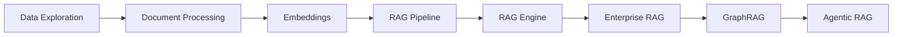

<div align="center">
  

  # Chapter 2: Data Readiness and Accessibility
</div>

---

## Overview

This chapter covers the foundational data readiness concepts required for building production-grade LLM applications on Google Cloud:

- **Data Readiness Dimensions**: Discoverability, accessibility, quality, format, governance
- **Unified Data Platform**: BigQuery, Cloud Storage, Vertex AI, Dataplex
- **Document Processing**: Extracting structured data from unstructured documents
- **RAG Evolution**: From Naive RAG → Advanced RAG → Agentic RAG
- **Vector Search**: Embeddings, indexing, and semantic search
- **GraphRAG**: Knowledge graphs for enhanced retrieval with Spanner Graph
- **Enterprise RAG**: Production-ready patterns with BigQuery and Cloud SQL
- **Security & Governance**: DLP, access controls, and data protection

## Learning Objectives

Upon completing this chapter's exercises, you will be able to:
- Explore and assess data quality using BigQuery
- Process unstructured documents with Document AI
- Generate text embeddings and perform semantic search
- Build a complete RAG pipeline with context assembly
- Use Vertex AI RAG Engine for managed retrieval-augmented generation
- Build an Enterprise RAG Knowledge Engine with BigQuery and Cloud SQL
- Implement GraphRAG with Spanner Graph for structured knowledge retrieval
- Create Agentic RAG applications with MCP and ADK

### Learning Path



## Notebooks

### Foundations

| # | Notebook | Description | Time |
|---|----------|-------------|------|
| 1 | [01_data_exploration_bigquery.ipynb](colabs/01_data_exploration_bigquery.ipynb) | Data discovery and quality assessment with BigQuery | ~10 min |
| 2 | [02_document_processing.ipynb](colabs/02_document_processing.ipynb) | Document AI and structured extraction | ~15 min |
| 3 | [03_embeddings_vector_search.ipynb](colabs/03_embeddings_vector_search.ipynb) | Text embeddings and semantic search | ~15 min |
| 4 | [04_rag_context_assembly.ipynb](colabs/04_rag_context_assembly.ipynb) | Building a complete RAG pipeline | ~15 min |
| 5 | [05_vertex_ai_rag_engine.ipynb](colabs/05_vertex_ai_rag_engine.ipynb) | Managed RAG with Vertex AI RAG Engine | ~15 min |

### Advanced RAG Patterns

| # | Notebook | Description | Time |
|---|----------|-------------|------|
| 6 | [06_enterprise_rag_knowledge_engine.ipynb](colabs/06_enterprise_rag_knowledge_engine.ipynb) | Enterprise RAG with BigQuery ML, Cloud SQL pgvector, and ADK | ~45 min |
| 7 | [07_graph_rag_spanner.ipynb](colabs/07_graph_rag_spanner.ipynb) | GraphRAG with Spanner Graph and Vertex AI Agent Engine | ~45 min |
| 8 | [08_agentic_rag_mcp_adk.ipynb](colabs/08_agentic_rag_mcp_adk.ipynb) | Agentic RAG with Model Context Protocol and ADK | ~30 min |

## Prerequisites

Before running the notebooks, ensure you have:

### 1. Google Cloud Project
- A Google Cloud project with billing enabled
- Project ID noted for configuration

### 2. Enable Required APIs
```bash
gcloud services enable \
    aiplatform.googleapis.com \
    bigquery.googleapis.com \
    bigquerystorage.googleapis.com \
    storage.googleapis.com \
    documentai.googleapis.com \
    sqladmin.googleapis.com \
    spanner.googleapis.com \
    bigqueryconnection.googleapis.com
```

### 3. IAM Permissions
Ensure your account has the following roles:
- `roles/bigquery.dataEditor`
- `roles/bigquery.jobUser`
- `roles/aiplatform.user`
- `roles/storage.objectViewer`
- `roles/cloudsql.admin` (for notebooks 06, 08)
- `roles/spanner.databaseAdmin` (for notebooks 07, 08)

## Quick Start

1. **Open in Colab**: Click the "Open in Colab" badge at the top of each notebook
2. **Authenticate**: Run the authentication cell when prompted
3. **Set Project ID**: Enter your Google Cloud project ID in the configuration cell
4. **Run All Cells**: Execute cells in order from top to bottom

## Directory Structure

```
chapter-2/
├── README.md                 # This file
├── colabs/                   # Jupyter notebooks
│   ├── 01_data_exploration_bigquery.ipynb
│   ├── 02_document_processing.ipynb
│   ├── 03_embeddings_vector_search.ipynb
│   ├── 04_rag_context_assembly.ipynb
│   ├── 05_vertex_ai_rag_engine.ipynb
│   ├── 06_enterprise_rag_knowledge_engine.ipynb
│   ├── 07_graph_rag_spanner.ipynb
│   └── 08_agentic_rag_mcp_adk.ipynb
├── data/
│   └── sample_documents/     # Sample files for exercises
└── solutions/                # Exercise solutions
```

## Sample Data

The notebooks use two data sources:

1. **BigQuery Public Datasets**: Pre-loaded datasets for immediate experimentation
   - `bigquery-public-data.samples.wikipedia`
   - `bigquery-public-data.patents_view.patent`

2. **Sample Documents**: Located in `data/sample_documents/` for document processing exercises

## Troubleshooting

### Authentication Issues
```python
# If authentication fails, try:
from google.colab import auth
auth.authenticate_user()
```

### Quota Errors
- Check your project quotas in the Cloud Console
- Consider using a different region if `us-central1` is at capacity

### Permission Denied
- Verify API is enabled: `gcloud services list --enabled`
- Check IAM roles: `gcloud projects get-iam-policy PROJECT_ID`

## Related Resources

- [Vertex AI Documentation](https://cloud.google.com/vertex-ai/docs)
- [BigQuery ML Documentation](https://cloud.google.com/bigquery/docs/bqml-introduction)
- [RAG Engine Documentation](https://cloud.google.com/vertex-ai/generative-ai/docs/rag-overview)
- [Spanner Graph Documentation](https://cloud.google.com/spanner/docs/graph/overview)
- [Agent Development Kit (ADK)](https://cloud.google.com/vertex-ai/generative-ai/docs/adk/overview)
- [Model Context Protocol (MCP)](https://modelcontextprotocol.io/)

---

> 📌 **Looking for Official GCP Notebooks?**  
> Google Cloud provides official notebooks for RAG patterns, Spanner Graph, and agent development.  
> Browse the [generative-ai repository](https://github.com/GoogleCloudPlatform/generative-ai) for the latest official examples.

---

[← Previous Chapter](../chapter-1/) | [Home](../) | [Next Chapter →](../chapter-3/)
