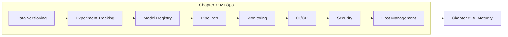

<div align="center">
  

  # Chapter 7: MLOps for Production-Ready AI and Agentic Systems
</div>

---

## Chapter Overview

This chapter bridges the gap between "the model works" and "the model works in production." It covers AgentOps—the systematic practices that transform working prototypes into production-ready systems—addressing the unique challenges of LLM applications: non-deterministic outputs, evolving language patterns, stateful agents, and complex cost structures.

## Learning Objectives

Upon completing this chapter, you will be able to:

- **Understand the AgentOps evolution** - Trace the progression from MLOps (2018-2022) through GenAI Ops (2023) to Agent Ops (2024+)
- **Implement data versioning and lineage** - Track training data, context data, and prompt templates with complete reproducibility
- **Build experiment tracking systems** - Capture relationships between models, prompts, and configurations for agentic systems
- **Configure comprehensive monitoring** - Use Cloud Trace for agent execution visibility and Model Monitoring for drift detection
- **Design CI/CD for AI systems** - Implement Cloud Build and Cloud Deploy pipelines with Binary Authorization
- **Apply security frameworks** - Enforce human controllers, limited powers, and observable actions with Model Armor
- **Manage costs intelligently** - Use FinOps Hub with Gemini Cloud Assist for AI-powered cost optimization

## Key Concepts

### The Nine Pillars of AgentOps

```
┌─────────────────────────────────────────────────────────────────────┐
│                        AGENTOPS PILLARS                             │
├─────────────┬─────────────┬─────────────┬─────────────┬────────────┤
│    Data     │   Model     │  Evaluation │   Deploy    │  Observe   │
├─────────────┼─────────────┼─────────────┼─────────────┼────────────┤
│  Security   │   Safety    │    Cost     │  Capacity   │   ...      │
└─────────────┴─────────────┴─────────────┴─────────────┴────────────┘
```

### MLOps Evolution

| Era | Primary Focus | Operational Question |
|-----|---------------|---------------------|
| **MLOps** (2018-2022) | Predictive models | Is the model's accuracy degrading? |
| **GenAI Ops** (2023) | Generative models | Is the output safe, relevant, and cost-effective? |
| **Agent Ops** (2024+) | Autonomous systems | Did the agent complete its task efficiently and safely? |

## Learning Resources

### Recommended Courses

| Course | Platform | Description |
|--------|----------|-------------|
| [5-Day Gen AI Intensive Course](https://www.kaggle.com/learn-guide/5-day-genai) | Kaggle | Day 5: MLOps for Generative AI, Agent Starter Pack walkthrough |
| [5-Day AI Agents Intensive Course](https://www.kaggle.com/learn-guide/5-day-agents) | Kaggle | Day 5: Prototype to Production with A2A protocol |

### Video Tutorials

| Video | Topic |
|-------|-------|
| [Agentic Security Fundamentals](https://youtu.be/jZXvqEqJT7o) | OWASP Top 10 for LLMs, Model Armor, agent identity |
| [Operationalize AI Agents](https://youtu.be/kJRgj58ujEk) | End-to-end architecture for building, deploying, evaluating agents |

---

## Hands-On Notebooks

Explore official Google Cloud notebooks aligned with Chapter 7 topics.

### Data Versioning & ML Metadata

| Notebook | Description |
|----------|-------------|
| [vertex-pipelines-ml-metadata.ipynb](https://github.com/GoogleCloudPlatform/vertex-ai-samples/blob/main/notebooks/official/ml_metadata/vertex-pipelines-ml-metadata.ipynb) | Tracking artifacts and metrics with Vertex ML Metadata, lineage tracing |
| [sdk-metric-parameter-tracking-for-custom-jobs.ipynb](https://github.com/GoogleCloudPlatform/vertex-ai-samples/blob/main/notebooks/official/ml_metadata/sdk-metric-parameter-tracking-for-custom-jobs.ipynb) | Tracking training parameters and prediction metrics |
| [sdk-metric-parameter-tracking-for-locally-trained-models.ipynb](https://github.com/GoogleCloudPlatform/vertex-ai-samples/blob/main/notebooks/official/ml_metadata/sdk-metric-parameter-tracking-for-locally-trained-models.ipynb) | Tracking for locally trained models |

### Experiment Tracking

| Notebook | Description |
|----------|-------------|
| [get_started_with_vertex_experiments.ipynb](https://github.com/GoogleCloudPlatform/vertex-ai-samples/blob/main/notebooks/official/experiments/get_started_with_vertex_experiments.ipynb) | Comprehensive guide to experiment creation and comparison |
| [get_started_with_vertex_experiments_autologging.ipynb](https://github.com/GoogleCloudPlatform/vertex-ai-samples/blob/main/notebooks/official/experiments/get_started_with_vertex_experiments_autologging.ipynb) | Autologging with scikit-learn, TensorFlow, PyTorch |
| [comparing_local_trained_models.ipynb](https://github.com/GoogleCloudPlatform/vertex-ai-samples/blob/main/notebooks/official/experiments/comparing_local_trained_models.ipynb) | Comparing and evaluating model experiments |
| [comparing_pipeline_runs.ipynb](https://github.com/GoogleCloudPlatform/vertex-ai-samples/blob/main/notebooks/official/experiments/comparing_pipeline_runs.ipynb) | Logging and comparing different pipeline jobs |
| [build_model_experimentation_lineage_with_prebuild_code.ipynb](https://github.com/GoogleCloudPlatform/vertex-ai-samples/blob/main/notebooks/official/experiments/build_model_experimentation_lineage_with_prebuild_code.ipynb) | Experimentation with lineage tracking |

### Model Registry

| Notebook | Description |
|----------|-------------|
| [get_started_with_model_registry.ipynb](https://github.com/GoogleCloudPlatform/vertex-ai-samples/blob/main/notebooks/official/model_registry/get_started_with_model_registry.ipynb) | Creating and registering model versions |
| [bqml_vertexai_model_registry.ipynb](https://github.com/GoogleCloudPlatform/vertex-ai-samples/blob/main/notebooks/community/model_registry/bqml_vertexai_model_registry.ipynb) | BigQuery ML and Model Registry integration |
| [vertex_ai_model_registry_automl_model_versioning.ipynb](https://github.com/GoogleCloudPlatform/vertex-ai-samples/blob/main/notebooks/community/model_registry/vertex_ai_model_registry_automl_model_versioning.ipynb) | AutoML model versioning |

### Pipelines & Automation

| Notebook | Description |
|----------|-------------|
| [pipelines_intro_kfp.ipynb](https://github.com/GoogleCloudPlatform/vertex-ai-samples/blob/main/notebooks/official/pipelines/pipelines_intro_kfp.ipynb) | Introduction to Vertex AI Pipelines with KFP |
| [google_cloud_pipeline_components_model_train_upload_deploy.ipynb](https://github.com/GoogleCloudPlatform/vertex-ai-samples/blob/main/notebooks/official/pipelines/google_cloud_pipeline_components_model_train_upload_deploy.ipynb) | Complete train-upload-deploy workflow |
| [challenger_vs_blessed_deployment_method.ipynb](https://github.com/GoogleCloudPlatform/vertex-ai-samples/blob/main/notebooks/official/pipelines/challenger_vs_blessed_deployment_method.ipynb) | A/B model deployment strategies |
| [multicontender_vs_champion_deployment_method.ipynb](https://github.com/GoogleCloudPlatform/vertex-ai-samples/blob/main/notebooks/official/pipelines/multicontender_vs_champion_deployment_method.ipynb) | Multi-model evaluation for production |
| [control_flow_kfp.ipynb](https://github.com/GoogleCloudPlatform/vertex-ai-samples/blob/main/notebooks/official/pipelines/control_flow_kfp.ipynb) | Implementing loops and conditionals in pipelines |

### Model Monitoring

| Notebook | Description |
|----------|-------------|
| [get_started_with_model_monitoring_setup.ipynb](https://github.com/GoogleCloudPlatform/vertex-ai-samples/blob/main/notebooks/official/model_monitoring/get_started_with_model_monitoring_setup.ipynb) | Foundational monitoring setup guide |
| [model_monitoring.ipynb](https://github.com/GoogleCloudPlatform/vertex-ai-samples/blob/main/notebooks/official/model_monitoring/model_monitoring.ipynb) | Detecting drift and anomalies with Explainable AI |
| [batch_prediction_model_monitoring.ipynb](https://github.com/GoogleCloudPlatform/vertex-ai-samples/blob/main/notebooks/official/model_monitoring/batch_prediction_model_monitoring.ipynb) | Monitoring batch predictions |
| [get_started_with_model_monitoring_custom.ipynb](https://github.com/GoogleCloudPlatform/vertex-ai-samples/blob/main/notebooks/official/model_monitoring/get_started_with_model_monitoring_custom.ipynb) | Monitoring custom tabular models |
| [get_started_with_model_monitoring_xgboost.ipynb](https://github.com/GoogleCloudPlatform/vertex-ai-samples/blob/main/notebooks/official/model_monitoring/get_started_with_model_monitoring_xgboost.ipynb) | XGBoost drift detection |

### Feature Store

| Notebook | Description |
|----------|-------------|
| [vertex_ai_feature_store_based_llm_grounding_tutorial.ipynb](https://github.com/GoogleCloudPlatform/vertex-ai-samples/blob/main/notebooks/official/feature_store/vertex_ai_feature_store_based_llm_grounding_tutorial.ipynb) | LLM grounding with Feature Store |
| [online_feature_serving_and_fetching_bigquery_data_with_feature_store_optimized.ipynb](https://github.com/GoogleCloudPlatform/vertex-ai-samples/blob/main/notebooks/official/feature_store/online_feature_serving_and_fetching_bigquery_data_with_feature_store_optimized.ipynb) | Online feature serving |
| [feature_monitoring_with_feature_registry.ipynb](https://github.com/GoogleCloudPlatform/vertex-ai-samples/blob/main/notebooks/official/feature_store/feature_monitoring_with_feature_registry.ipynb) | Feature monitoring with registry |

### Model Deployment

| Notebook | Description |
|----------|-------------|
| [get_started_with_dedicated_endpoint.ipynb](https://github.com/GoogleCloudPlatform/vertex-ai-samples/blob/main/notebooks/official/prediction/get_started_with_dedicated_endpoint.ipynb) | Using dedicated endpoints |
| [get_started_with_vertex_private_endpoints.ipynb](https://github.com/GoogleCloudPlatform/vertex-ai-samples/blob/main/notebooks/official/prediction/get_started_with_vertex_private_endpoints.ipynb) | Private endpoints configuration |
| [llm_streaming_prediction.ipynb](https://github.com/GoogleCloudPlatform/vertex-ai-samples/blob/main/notebooks/official/prediction/llm_streaming_prediction.ipynb) | LLM streaming and batch predictions |
| [SDK_Custom_Container_Prediction.ipynb](https://github.com/GoogleCloudPlatform/vertex-ai-samples/blob/main/notebooks/official/custom/SDK_Custom_Container_Prediction.ipynb) | Custom container serving with FastAPI |

### Explainable AI

| Notebook | Description |
|----------|-------------|
| [xai_image_classification_feature_attributions.ipynb](https://github.com/GoogleCloudPlatform/vertex-ai-samples/blob/main/notebooks/official/explainable_ai/xai_image_classification_feature_attributions.ipynb) | Feature-based explanations for images |
| [xai_text_classification_feature_attributions.ipynb](https://github.com/GoogleCloudPlatform/vertex-ai-samples/blob/main/notebooks/official/explainable_ai/xai_text_classification_feature_attributions.ipynb) | Shapley method for text models |
| [sdk_custom_tabular_regression_online_explain.ipynb](https://github.com/GoogleCloudPlatform/vertex-ai-samples/blob/main/notebooks/official/explainable_ai/sdk_custom_tabular_regression_online_explain.ipynb) | Online prediction with explanations |

### GenAI/LLM Operations

| Notebook | Description |
|----------|-------------|
| [backoff_and_retry_for_LLMs.ipynb](https://github.com/GoogleCloudPlatform/vertex-ai-samples/blob/main/notebooks/community/generative_ai/backoff_and_retry_for_LLMs.ipynb) | Resilience patterns for LLM operations |
| [text_embedding_api_cloud_next_new_models.ipynb](https://github.com/GoogleCloudPlatform/vertex-ai-samples/blob/main/notebooks/community/generative_ai/text_embedding_api_cloud_next_new_models.ipynb) | Text embeddings and foundation models |

### Agent Operations

| Notebook | Description |
|----------|-------------|
| [adk_inline_source_deployment.ipynb](https://github.com/GoogleCloudPlatform/vertex-ai-samples/blob/main/notebooks/community/agent_engine/adk_inline_source_deployment.ipynb) | ADK inline source deployment |

> **Browse all notebooks**: [Official](https://github.com/GoogleCloudPlatform/vertex-ai-samples/tree/main/notebooks/official) | [Community](https://github.com/GoogleCloudPlatform/vertex-ai-samples/tree/main/notebooks/community)

---

## Chapter Roadmap



## What's Next

In **Chapter 8**, you'll explore the AI and Agentic Maturity Framework—helping you assess where your organization stands across multiple dimensions and plan your journey from tactical AI adoption to transformational integration.

---

[← Previous Chapter](../chapter-6/) | [Home](../) | [Next Chapter →](../chapter-8/)
