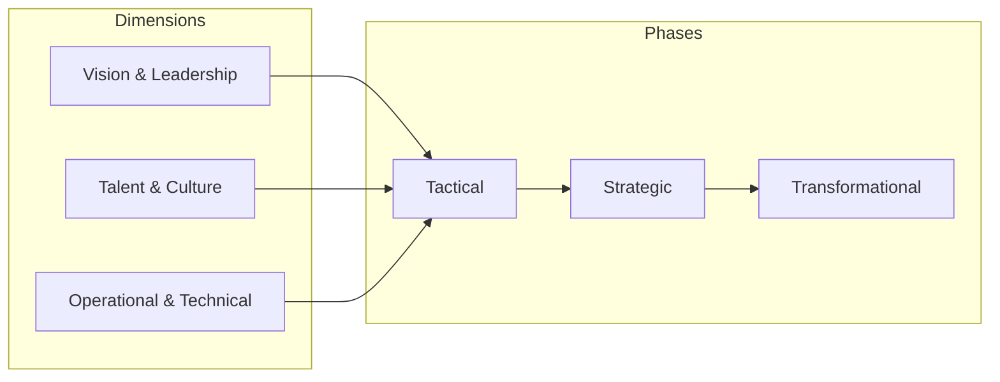
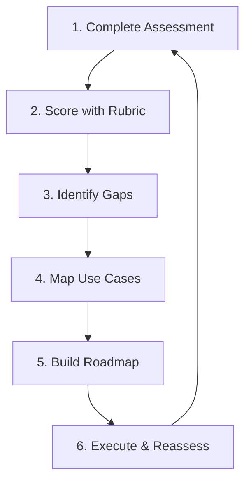

# Chapter 8: The AI and Agentic Maturity Framework

This chapter provides a comprehensive framework for assessing and advancing your organization's AI capabilities. Moving beyond technical implementation, it focuses on the strategic, cultural, and operational dimensions that determine whether AI initiatives deliver sustained business value.

## Overview

The AI and Agentic Maturity Framework evaluates organizational readiness across three dimensions and three phases:

| Dimension | Focus | Key Questions |
|-----------|-------|---------------|
| **Vision & Leadership** | The "What" and "Why" | Is AI funding multiyear? Can the CEO articulate AI's role? |
| **Talent & Culture** | The "Who" | Is AI literacy universal? Are failed experiments celebrated? |
| **Operational & Technical** | The "How" | Is MLOps automated? Are security guardrails embedded? |

---

## Assessment Tools

This chapter provides practical templates for organizational AI maturity assessment:

| Asset | Purpose | Use Case |
|-------|---------|----------|
| [maturity_assessment.md](./maturity_assessment.md) | Self-assessment workbook | Score your organization across 28+ questions |
| [maturity_rubric.md](./maturity_rubric.md) | Detailed phase descriptions | Understand what each maturity level looks like |
| [use_case_mapping.md](./use_case_mapping.md) | Prioritization template | Map AI use cases by value vs. effort |
| [roadmap_template.md](./roadmap_template.md) | Transition planning | Plan your journey between phases |
| [resources.md](./resources.md) | Learning paths | Certifications, frameworks, further reading |

---

## Quick Start: How to Use These Tools

### Step 1: Complete the Self-Assessment

1. Gather stakeholders from leadership, HR, and technical teams
2. Complete [maturity_assessment.md](./maturity_assessment.md) independently
3. Aggregate scores by dimension
4. Discuss areas of disagreement

### Step 2: Interpret Your Scores

Use [maturity_rubric.md](./maturity_rubric.md) to understand:
- **Tactical (Score 1-2)**: Ad hoc, siloed, reactive
- **Strategic (Score 3-4)**: Centralized, standardized, proactive
- **Transformational (Score 5)**: Embedded, automated, self-optimizing

### Step 3: Prioritize Use Cases

Use [use_case_mapping.md](./use_case_mapping.md) to identify:
- **Quick Wins**: High value, easy to execute
- **Strategic Bets**: High value, requires investment
- **Fill-ins**: Low value, easy (do if resources allow)
- **Avoid**: Low value, hard (deprioritize)

### Step 4: Build Your Roadmap

Use [roadmap_template.md](./roadmap_template.md) to plan:
- Phase transition milestones
- Resource allocation (people, process, technology)
- Success criteria by dimension

---

## The Three Phases

### Tactical Phase

Organizations at this phase are characterized by:

- **Vision**: Ad hoc AI pilots without central coordination
- **Talent**: Siloed expertise, limited AI literacy programs
- **Operations**: Manual processes, fragmented tooling, reactive security

**Key Challenge**: "Pilot purgatory" - successful experiments fail to scale.

### Strategic Phase

Organizations at this phase demonstrate:

- **Vision**: Dedicated multiyear budget, executive sponsorship, responsible AI principles
- **Talent**: Structured upskilling programs, safe-to-fail culture, defined career paths
- **Operations**: Centralized MLOps platform, automated CI/CD, proactive monitoring

**Key Achievement**: Repeatable, scalable AI capabilities with governance.

### Transformational Phase

Organizations at this phase exhibit:

- **Vision**: AI embedded in business model, CEO as visible champion
- **Talent**: AI fluency as core competency, human-AI collaboration as default
- **Operations**: AIOps (self-optimizing pipelines), A2A/A2H protocols, FinOps agents

**Key Outcome**: AI drives sustained competitive advantage and shapes industry standards.

---

## Data Readiness Foundation

A strong data strategy is foundational to AI maturity. The concepts from Chapter 2 directly enable progression:

| Phase | Data Capability |
|-------|-----------------|
| **Tactical** | Struggle with data discoverability and quality |
| **Strategic** | Robust governance, semantic layer, trustworthy data foundation |
| **Transformational** | Fully integrated, agile, seamless data accessibility |

> "The journey through the AI and agentic maturity framework is, in practice, the journey of mastering your data strategy."

---

## Platform Approaches

Two key platform categories accelerate maturity:

### Vertex AI Platform

The technical engine for AI production:
- **Governance**: Model Registry, ML Metadata, Explainable AI
- **Integration**: Native BigQuery, Extensions (function calling), RAG
- **Velocity**: Automated pipelines, managed serving, AIOps capability

### Gemini Enterprise

The agentic platform for every user:
- **Prebuilt Agents**: Deep Research, Idea Generation, Data Insights
- **No-Code Agents**: Natural language-based agent creation
- **Enterprise Hub**: Unified access to all AI assets and knowledge

---

## Fictional Company Examples

This chapter uses three examples to illustrate maturity transitions:

| Company | Industry | Scenario | Phase Transition |
|---------|----------|----------|------------------|
| **Cymbal Health** | Healthcare Payer | Clinical note summarizer pilot | Tactical → Strategic |
| **Cymbal Retail** | Multichannel Retail | AI Center of Excellence | Strategic → Transformational |
| **Cymbal Media** | Content/Advertising | Self-optimizing agent network | Transformational (maintaining) |

See worked examples in each assessment template.

---

## External Resources

### Google Cloud Certifications

| Certification | Audience | Focus |
|---------------|----------|-------|
| [Generative AI Leader](https://cloud.google.com/learn/certification/generative-ai-leader) | Non-technical leaders | AI impact on HR, marketing, finance, sales |
| [Cloud Digital Leader](https://cloud.google.com/learn/certification/cloud-digital-leader/) | All roles | Google Cloud fundamentals |
| [Professional Cloud Architect](https://cloud.google.com/learn/certification/cloud-architect) | Infrastructure designers | Well-Architected Framework, security |
| [Professional ML Engineer](https://cloud.google.com/learn/certification/machine-learning-engineer) | Practitioners | MLOps, generative AI operationalization |

### AI Maturity Frameworks

- [Google Cloud AI Adoption Framework (2020)](https://cloud.google.com/resources/cloud-ai-adoption-framework-whitepaper) - Foundation for this chapter's three-phase model
- [Scaling Agentic AI (2024)](https://dr-arsanjani.medium.com/scaling-agentic-ai-86a541f10aad) - Agentic maturity model approach
- [ROI of AI 2025](https://cloud.google.com/resources/content/roi-of-ai-2025) - Business value measurement
- [MITRE AI Maturity Model](https://aimaturitymodel.mitre.org/) - 6-pillar assessment tool

### Compliance

- [EU AI Act](https://www.europarl.europa.eu/topics/en/article/20230601STO93804/eu-ai-act-first-regulation-on-artificial-intelligence) - Landmark AI legislation
- [EU AI Act Penalties](https://artificialintelligenceact.eu/article/99/) - Fines up to 35M euros or 7% of global turnover

---

## Key Insight

Organizations with mature AI governance frameworks outperform competitors by **$8.4 billion annually** in combined operational efficiency, risk mitigation, and revenue acceleration (Axis Intelligence, 2025).

---

## Related Chapters

| Chapter | Connection |
|---------|------------|
| [Chapter 2](../chapter-2/) | Data Readiness - Foundation for all AI maturity |
| [Chapter 5](../chapter-5/) | Evaluation - Measuring AI quality and performance |
| [Chapter 7](../chapter-7/) | MLOps - Operationalizing AI systems |

---

[← Previous Chapter](../chapter-7/) | [Home](../) | [Next Chapter →](../chapter-9/)
